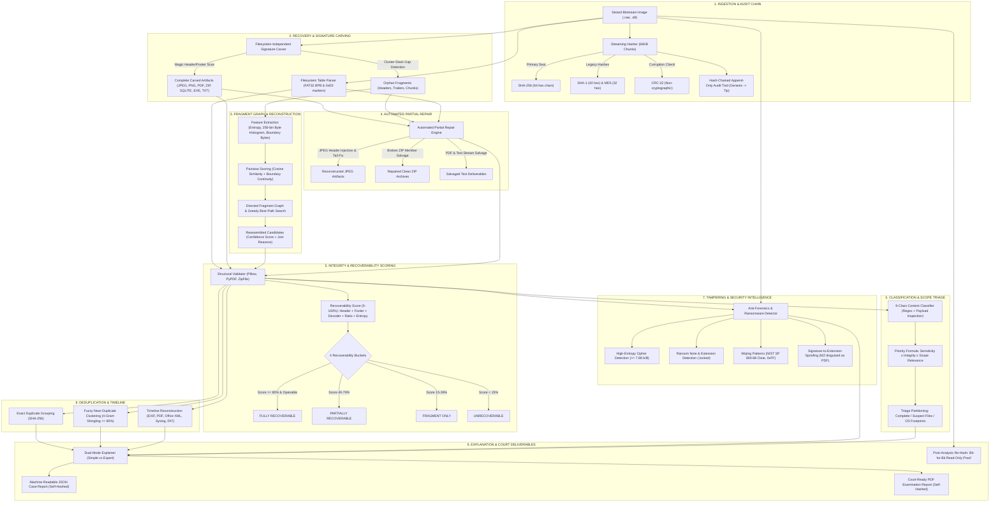

# ReconAI: Architecture, Models & Judge Demonstration Guide

> **CalmStacks 24h Hackathon — Track: "Cybersecurity & AI"**  
> **Project:** ReconAI — AI-Assisted Digital Evidence Reconstruction, Recovery & Forensic Triage Engine  
> **Authors:** Team ReconAI

---

## 🏗️ 1. Complete Pipeline Architecture Diagram

---

## 🧠 2. AI, Statistical & Heuristic Models Description

### Model 1: Multi-Dimensional Fragment Feature Extraction & Reassembly
* **Model Type:** Cosine Similarity of 256-Bin Byte Frequency Distributions + Boundary Entropy Transition Gradients + Directed Graph Pathfinding.
* **Why Chosen:** 
  Standard disk recovery tools fail on fragmented files because FAT cluster pointers are wiped upon deletion. Pure brute-force concatenation is $O(N!)$. By mapping each fragment into a normalized 256-dimensional byte frequency space $\vec{v}$, files of the same format and stream exhibit high cosine similarity:
  $$\text{Sim}_{\text{hist}}(\vec{v}_i, \vec{v}_j) = \frac{\vec{v}_i \cdot \vec{v}_j}{\|\vec{v}_i\| \|\vec{v}_j\|}$$
  Coupled with a boundary entropy continuity check ($\Delta \text{Entropy} < 0.8$) and format grammar verification, this reduces fragment matching to an efficient best-path graph traversal that provides explicit mathematical join reasons.

### Model 2: 5-Factor Recoverability Scoring & 4 Strict Buckets
* **Model Type:** Weighted Structural Validator with Decoder Feedback.
* **Why Chosen:**
  Ordinary recovery tools simply output binary files without telling the user if the file will actually open. ReconAI tests every file against real decoders (Pillow for images, PyPDF for documents, ZipFile for archives, UTF-8 parser for text/code) and computes:
  $$\text{Score} = w_{\text{hdr}} (25) + w_{\text{ftr}} (20) + w_{\text{decode}} (35) + w_{\text{ratio}} (10) + w_{\text{entropy}} (10)$$
  Every file is sorted into **Fully Recoverable**, **Partially Recoverable**, **Fragment Only**, or **Unrecoverable**, answering directly: *"What can realistically be restored?"*

### Model 3: Automated Partial Repair Engine
* **Model Type:** Format-Specific Binary Stream Patching & Archive Salvaging.
* **Why Chosen:**
  When files are damaged, commercial tools discard them. ReconAI injects valid JFIF/DQT headers into orphan JPEGs, terminates missing tails with `\xFF\xD9`, and extracts all uncorrupted member files from broken ZIPs/Office documents into clean derived containers marked `"RECONSTRUCTED – derived artifact"`, leaving the original evidence untouched.

### Model 4: Threat-Weighted Scope Prioritization Formula
* **Model Type:** Multi-Factor Decision Matrix ($S \times I \times R$).
* **Why Chosen:**
  $$\text{Priority Score} = \text{Sensitivity Weight} \times \frac{\text{Integrity Score}}{100} \times \text{Scope Relevance} \times 100$$
  This ensures an intact leaked AWS credentials file or ransomware note immediately ranks #1 (Priority: 100/100), while low-integrity system logs are deprioritized.

### Model 5: Anti-Forensics & Ransomware Detector
* **Model Type:** Shannon Entropy Windowing ($\ge 7.88$ b/B) + Extension Spoofing Signature Matrix + Wiping Run-Length Analysis.
* **Why Chosen:**
  Catches deliberate evidence tampering: distinguishes high-entropy encrypted blobs from compressed archives, detects NIST SP 800-88 zero-fills, and spots executable malware disguised with `.pdf` extensions.

### Model 6: Fuzzy 4-Gram Shingle Clustering
* **Model Type:** Jaccard Shingling ($\ge 80\%$ similarity threshold) + SHA-256 Exact Matching.
* **Why Chosen:**
  Prevents evidence fatigue: collapses 10 fragmented copies or revisions of a file into a single canonical cluster showing occurrence counts and sector locations.

### Model 7: Cryptographic Hash-Chained Audit Trail
* **Model Type:** Linked SHA-256 Ledger (Genesis $\to$ Tip).
* **Why Chosen:**
  Adheres to ISO/IEC 27037 standards for digital evidence integrity. Proves zero post-analysis tampering with mathematical non-repudiation.

---

## 🎯 3. 5-Step Demo Script for Judges

Follow this structured 5-step script during your presentation to stand out in front of the CalmStacks judges:

### Step 1: Prove Cryptographic Chain of Custody & Read-Only Guarantee (1 min)
1. Point to the left sidebar: show the **Seized Case Disk (64 MB)**.
2. Highlight the **Chain of Custody & Verification** panel:
   - Point out the **Exact Byte Count**: `64.0 MB (67,108,864 bytes)`.
   - Point out the **Primary SHA-256 Seal** (displayed in full with 1-click copy).
   - Point out the separation of **CRC-32** as a physical I/O transfer check rather than a cryptographic seal.
   - Show the green **Strict Forensic Read-Only Access (`O_RDONLY`)** alert banner.
3. Open the **"🔍 Cross-Verify Acquisition Hash"** expander: paste the disk SHA-256 to show the live `✅ Bit-for-Bit Match!` verification.

### Step 2: Launch the 10-Stage Pipeline & Show Real-Time Autonomous Recovery (1 min)
1. Select **Extraction Scope**: `⚖️ Complete Forensic Triage`.
2. Click **🚀 Run Recovery Pipeline**.
3. Watch the progress bar execute the 10 autonomous stages:
   - *Ingestion $\to$ Undelete $\to$ Signature Carving $\to$ AI Fragment Reassembly $\to$ Recoverability Bucketing $\to$ Partial Repair $\to$ Scope Triage $\to$ Tampering Audit $\to$ Deduplication $\to$ Timeline.*
4. Point out the post-analysis verification badge:
   `✅ Post-Analysis Read-Only: VERIFIED (Bit-for-Bit SHA-256 Match)`. This proves to judges that the tool touched the evidence without altering a single bit.

### Step 3: Spotlight the Core Differentiators: Buckets & Partial Repair (1.5 min)
1. Navigate to **Tab 1: Triage Overview**:
   - Highlight the **4 Recoverability Buckets**:
     - *Fully Recoverable (e.g. 70%)*, *Partially Recoverable*, *Fragment Only*, *Unrecoverable*.
     - Point out how this directly answers: *"What can realistically be restored?"*
2. Show the **Evidence Tampering Indicators** callout:
   - Point out the detected **Ransomware Encrypted File (`DATA.LOCKED`)** and **Extortion Ransom Note (`DECRYPT.TXT`)**.
   - Show the **Extension Spoofing Alert**: `INVOICE.PDF` was flagged because it actually contains a hidden Windows PE executable (`MZ` header).
   - Show the **Anti-Forensic Wiping Alert**: 16KB of contiguous zero-fills matching NIST SP 800-88 Clear.
3. Open the **Reconstructed Derived Artifacts** section:
   - Show how ReconAI repaired the truncated JPEG and salvaged intact member files from `BACKUP.ZIP`, clearly watermarked as `"RECONSTRUCTED – derived artifact"`.

### Step 4: Demonstrate AI Fragment Reconstruction with Math & Reasons (1 min)
1. Show the **AI-Reassembled Suspect Passport Photo (`reassembled_jpeg_...`)**:
   - Explain: *"The suspect split this photo across two non-contiguous disk clusters separated by 12KB of slack space. Traditional undelete tools lose this file completely."*
   - Show the **Confidence Score (81.2%)** and the explicit **Join Reasons**:
     - *Byte distribution cosine similarity: 94.2%*
     - *Boundary entropy continuity: $\Delta 0.12$*
     - *Valid JPEG stream verified via Pillow decode.*
   - Emphasize to judges: **No black-box guesses. Every join is mathematically explained.**

### Step 5: Dual-Mode Explanations & Self-Hashed Court Reports (1 min)
1. Toggle between **"Simple Mode"** (for ordinary users/judges) and **"Expert Mode"** (for forensic examiners) in the Summary tab.
2. Navigate to **Tab 5: Forensic Report**:
   - Show the **Append-Only Hash-Chained Audit Trail**: show Block 0 (Genesis) through Block 10, all cryptographically sealed.
   - Click **`⬇️ Export Case Report (PDF)`** and **`⬇️ Export Case Report (JSON)`**.
   - Show that the report contains its own **Embedded SHA-256 Seal** for complete judicial admissibility.
3. Conclude: *"ReconAI proves that AI-assisted recovery can be transparent, mathematically verifiable, and court-admissible."*
