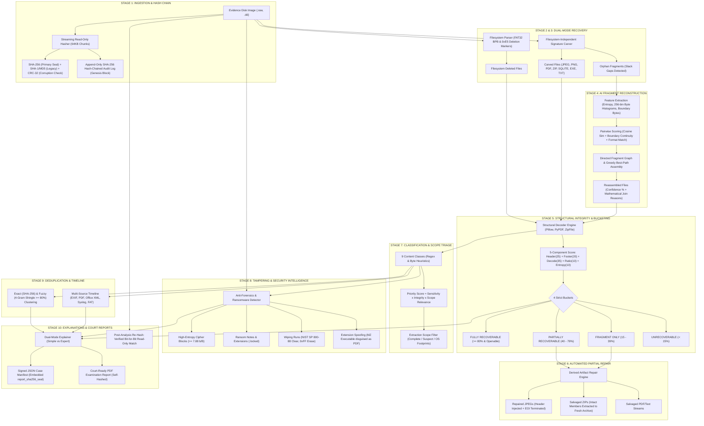

# 🛡️ ReconAI: Complete Master Project Knowledge Base & Architecture Overview

> **Project:** ReconAI — AI-Assisted Digital Evidence Reconstruction, Recovery & Forensic Triage Engine  
> **Event:** CalmStacks 24h Hackathon | **Track:** Cybersecurity & AI  
> **Repository:** `/Users/muhammedmustaqheem/Desktop/NOVA`  
> **Web Application:** `http://localhost:8501`  
> **Tech Stack:** 100% Free & Open-Source (Python 3.9, Streamlit, NumPy, Pillow, PyPDF, NetworkX, Pyvis, Scikit-Learn, SQLite)  
> **Last Updated:** 2026-09-25  

---

## 1. Executive Summary & Problem Statement

### The Problem
Traditional forensic data recovery tools (e.g., standard carving in Autopsy, basic `dd`/scalpel/foremost) suffer from critical limitations when handling corrupted, deleted, or intentionally sabotaged storage drives:
1. **Broken Cluster Chains:** When files are deleted on FAT/NTFS filesystems, cluster allocation tables are zeroed out. Fragmented files (e.g., non-contiguous clusters) cannot be reassembled by standard carvers and are lost or recovered as corrupt gibberish.
2. **Black-Box "Openability" Guesswork:** Standard carvers dump thousands of raw files without verifying whether they can actually open or decode, overwhelming investigators with unrecoverable junk.
3. **No Automated Repair:** Damaged files with truncated footers or missing headers are discarded rather than partially salvaged.
4. **Evidence Overload & Jargon Fatigue:** Forensic outputs are technical and opaque for non-technical stakeholders (investigators, lawyers, judges, executives).
5. **Anti-Forensics Blindspots:** Threat actors deliberately encrypt files with ransomware, run multi-pass disk wiping tools (e.g., NIST SP 800-88), or disguise malware by changing `.exe` to `.pdf`. Traditional recovery tools treat these as mere read errors.

### The Solution: ReconAI
ReconAI is an autonomous, AI-assisted digital evidence recovery and forensic triage engine. It goes beyond simple undelete operations by:
- Mathematically reconstructing fragmented files across disk slack gaps using **256-bin byte frequency histogram cosine similarity** and **boundary entropy continuity**.
- Evaluating decoder health to place every file into **4 strict Recoverability Buckets** (*Fully Recoverable*, *Partially Recoverable*, *Fragment Only*, *Unrecoverable*), answering directly: *"What can realistically be restored?"*
- Producing **derived reconstructed artifacts** (repaired JPEGs, salvaged ZIP members, extracted PDF text streams) kept strictly separate from original evidence.
- Detecting **anti-forensics indicators** (ransomware ciphers, disk wiping runs, and extension spoofing).
- Enforcing **court-grade cryptographic non-repudiation** through an append-only SHA-256 hash-chained audit log and post-analysis re-hash verification.
- Translating complex low-level byte streams into **dual-mode plain-English narratives** (*Simple Mode* for users and *Expert Mode* for DFIR examiners).

---

## 2. End-to-End System Architecture



---

## 3. The 12 Hackathon Capabilities in Detail

### 1. Real Chain of Custody & Hash-Chained Audit Trail
- **Module:** [`reconai/ingest/custody_logger.py`](file:///Users/muhammedmustaqheem/Desktop/NOVA/reconai/ingest/custody_logger.py) & [`reconai/ingest/hasher.py`](file:///Users/muhammedmustaqheem/Desktop/NOVA/reconai/ingest/hasher.py)
- **Strict Hierarchy:**
  - **Primary Forensic Seal:** SHA-256 (64 hex characters) displayed in full with a native 1-click copy button.
  - **Legacy Compatibility Hashes:** SHA-1 (40 hex chars) and MD5 (32 hex chars) grouped under an expander for cross-agency/legacy tool verification (EnCase, FTK).
  - **Corruption Check:** CRC-32 clearly categorized as a physical I/O hardware read guard, not a cryptographic seal.
- **Exact Byte Counts:** Displays both rounded and exact physical byte count: `64.0 MB (67,108,864 bytes)`.
- **Append-Only Audit Log:** Implements an internal cryptographic ledger where every action taken on evidence is recorded in an entry block:
  $$H_i = \text{SHA256}(H_{i-1} \parallel \text{step} \parallel \text{action} \parallel \text{timestamp} \parallel \text{canonical\_json}(\text{details}))$$
  Block 0 is the Genesis block bound to the disk's initial SHA-256 seal. The audit engine verifies the entire chain upon completion to guarantee tamper-free processing.
- **Post-Analysis Read-Only Verification:** Automatically re-hashes the disk image upon pipeline completion and displays a green verification banner: `✅ Post-Analysis Read-Only: VERIFIED (Bit-for-Bit SHA-256 Match)`.

### 2. Filesystem-Independent Signature Carving
- **Module:** [`reconai/carve/carver.py`](file:///Users/muhammedmustaqheem/Desktop/NOVA/reconai/carve/carver.py) & [`reconai/carve/signatures.py`](file:///Users/muhammedmustaqheem/Desktop/NOVA/reconai/carve/signatures.py)
- Works without a filesystem across raw unallocated byte streams.
- Supported signatures:
  - **JPEG:** Header `\xFF\xD8\xFF`, Footer `\xFF\xD9`
  - **PNG:** Header `\x89PNG\r\n\x1a\n`, Footer `IEND\xaeB\x60\x82`
  - **PDF:** Header `%PDF-`, Footer `%%EOF`
  - **ZIP / Office (DOCX, XLSX, PPTX):** Header `PK\x03\x04`, Footer `PK\x05\x06` + 18-byte EOCD structure
  - **SQLite 3:** Header `SQLite format 3\x00` (calculates size via page-size and page-count header fields)
  - **Windows PE / Executable:** Header `MZ` with PE signature validation at offset `0x3C` (`PE\x00\x00`)
  - **MP4 / Video:** `ftyp` atom container detection
  - **Text / Logs:** Sector-aligned UTF-8 character density scanning ($\ge 85\%$ printable)
- Records for every carved artifact: `offset`, `length`, `detected_type`, `has_header`, and `has_footer`.

### 3. AI Fragment Reconstruction Engine (Core Differentiator)
- **Module:** [`reconai/reassemble/fragment_engine.py`](file:///Users/muhammedmustaqheem/Desktop/NOVA/reconai/reassemble/fragment_engine.py)
- **Problem Solved:** When a file is fragmented across non-contiguous clusters with cluster slack (e.g., zero-fills or unrelated data) in between, standard carvers truncate or corrupt it.
- **Feature Extraction:**
  1. **Byte Frequency Histogram:** Normalized 256-dimensional vector $\vec{v} = [f_0, f_1, \dots, f_{255}]$.
  2. **Shannon Entropy:** Evaluated across the fragment body, the first 64 bytes (head), and the last 64 bytes (tail):
     $$H(X) = -\sum_{i=0}^{255} P(x_i) \log_2 P(x_i)$$
  3. **Boundary Transition Gradient:** Evaluates entropy jump $\Delta H = |H_{\text{tail}}(A) - H_{\text{head}}(B)|$.
- **Pairwise Scoring Formula:**
  $$\text{Score}(A, B) = 0.40 \cdot \text{CosineSim}(\vec{v}_A, \vec{v}_B) + 0.35 \cdot \left(1.0 - \frac{\Delta H}{3.5}\right) + 0.25 \cdot \text{FormatCompat} + \text{OffsetBonus}$$
- **Graph Reassembly:** Builds a directed Fragment Graph where vertices are fragments and edge weights are link likelihood scores. Uses greedy best-path traversal starting at header nodes, traversing through bodies, and terminating at trailers.
- **Transparent Output:** Returns reassembled candidates with a 0–100% confidence score and **explicit, human-readable join reasons** (e.g., *"Byte distribution similarity: 94.2%"*, *"Boundary entropy continuity: $\Delta 0.12$ (score 96.6%)"*, *"Valid JPEG stream verified via Pillow"*).

### 4. 5-Factor Recoverability Scoring & 4 Strict Buckets
- **Module:** [`reconai/integrity/validator.py`](file:///Users/muhammedmustaqheem/Desktop/NOVA/reconai/integrity/validator.py)
- Evaluates real decoder openability using Pillow, PyPDF, ZipFile, and UTF-8 decoders.
- **Recoverability Scoring Breakdown (0–100%):**
  - **Valid Header Signature:** 25 points
  - **Valid Footer / EOCD Trailer:** 20 points
  - **Programmatic Decoder Parsing:** 35 points (full image verify/load, PDF page count extraction, ZIP CRC-32 testing)
  - **Recovery Length Ratio:** 10 points
  - **Entropy Health:** 10 points
- **The 4 Strict Buckets:**
  1. **`FULLY RECOVERABLE`** (Score $\ge 80\%$ and opens cleanly): Intact files ready for court presentation.
  2. **`PARTIALLY RECOVERABLE`** (Score $40 - 79\%$): Incomplete files with salvageable text, partial images, or broken archive members.
  3. **`FRAGMENT ONLY`** (Score $15 - 39\%$): Disconnected chunks lacking headers or trailers.
  4. **`UNRECOVERABLE`** (Score $< 15\%$): Overwritten, zero-filled, or destroyed payloads.
- Directly answers: *"What can realistically be restored?"* with exact counts, percentages, and an executive verdict string.

### 5. Automatic Partial Repair Engine (Derived Artifacts)
- **Module:** [`reconai/repair/repairer.py`](file:///Users/muhammedmustaqheem/Desktop/NOVA/reconai/repair/repairer.py)
- **Forensic Principle:** Never alter original evidence. All repairs produce separate derived files watermarked as `"RECONSTRUCTED – derived artifact"`.
- **Repair Capabilities:**
  - **JPEG Repair:** Injects standard JFIF APP0 and DQT table headers if missing; strips trailing corruption and appends `\xFF\xD9` EOI to make truncated images viewable in standard viewers.
  - **ZIP / Office Salvage:** Scans the raw payload for local file headers (`PK\x03\x04`), decompresses undamaged members, and generates a fresh, clean ZIP archive.
  - **PDF & Text Salvage:** Bypasses broken cross-reference (`xref`) tables to extract all readable text streams.

### 6. 9-Class Content Classification & Scope Prioritization
- **Module:** [`reconai/classify/classifier.py`](file:///Users/muhammedmustaqheem/Desktop/NOVA/reconai/classify/classifier.py)
- Classifies recovered artifacts into 9 standardized content classes:
  1. `Credentials & Keys` (Weight: 1.00) — AWS keys (`AKIA...`), DB URLs, private keys, API tokens
  2. `Financial` (Weight: 0.95) — Ethereum (`0x...`) / Bitcoin addresses, wire transfer invoices, credit cards
  3. `Personal Data (PII)` (Weight: 0.90) — Emails, phone numbers, SSNs, passports
  4. `Document` (Weight: 0.80) — PDFs, DOCX, TXT, Markdown
  5. `Encrypted Blobs` (Weight: 0.75) — High-entropy cipher streams
  6. `Logs` (Weight: 0.70) — Syslog, SSH authentication logs (`sshd[...]`), web server logs
  7. `Image` (Weight: 0.65) — JPEG, PNG, BMP photos
  8. `Source Code` (Weight: 0.60) — Python, SQL, C, JavaScript, Shell scripts
  9. `Executables` (Weight: 0.50) — Windows PE, ELF binaries
- **Priority Formula:**
  $$\text{Priority Score} = \text{Sensitivity Weight} \times \left(\frac{\text{Integrity Score}}{100}\right) \times \text{Scope Relevance} \times 100$$
- **Active Extraction Scope Filtering:**
  - *Complete Forensic Triage:* Retains all artifacts, separating User Evidence from System/OS files.
  - *Suspect Files Only:* Filters strictly to contraband (Credentials, Financial, PII, Documents, Images).
  - *System & OS Footprints:* Filters strictly to infrastructure (Logs, Source Code, System Configs, Executables).

### 7. Ransomware & Anti-Forensics Detection (Tampering Indicators)
- **Module:** [`reconai/tampering/tampering_detector.py`](file:///Users/muhammedmustaqheem/Desktop/NOVA/reconai/tampering/tampering_detector.py)
- Detects deliberate attempts to conceal or destroy evidence:
  1. **High-Entropy Cipher Detection:** Scans disk blocks for entropy $\ge 7.88$ bits/byte without standard compression headers (ZIP/GZIP/PNG), flagging suspected ransomware encryption.
  2. **Ransomware Extensions & Notes:** Detects extensions like `.locked`, `.crypto`, `.enc`, and extortion note text patterns (*"YOUR FILES HAVE BEEN ENCRYPTED"*, *"TOR browser"*, *"send bitcoin to..."*).
  3. **Disk Sanitization Wipes:** Detects contiguous blocks ($\ge 8192$ bytes) of `\x00` (NIST SP 800-88 Clear) and `\xFF` (flash bulk erase).
  4. **Extension Spoofing:** Identifies anti-forensic masquerading, such as an executable (`MZ` header) disguised with an innocent `.pdf` extension.
- Generates plain-language *Evidence Tampering Indicators* with severity ratings and sector offsets.

### 8. Exact & Near-Duplicate Clustering
- **Module:** [`reconai/cluster/clusterer.py`](file:///Users/muhammedmustaqheem/Desktop/NOVA/reconai/cluster/clusterer.py)
- **Exact Duplicates:** Grouped bit-for-bit via SHA-256 hashes.
- **Near-Duplicates:** Computes rolling 4-gram byte shingles:
  $$J(S_A, S_B) = \frac{|S_A \cap S_B|}{|S_A \cup S_B|}$$
  Clusters items with Jaccard similarity $\ge 80\%$, collapsing ten fragmented copies or revisions of a file into a single canonical cluster showing occurrence counts and sector offset lists.

### 9. Multi-Source Timeline Reconstruction
- **Module:** [`reconai/timeline/timeline_builder.py`](file:///Users/muhammedmustaqheem/Desktop/NOVA/reconai/timeline/timeline_builder.py)
- Aggregates timestamps across diverse evidence sources:
  - EXIF metadata from photos (`DateTimeOriginal`, `CreateDate`)
  - PDF document catalogs (`/CreationDate`, `/ModDate`)
  - Office XML archives (`docProps/core.xml` `<dcterms:created>`)
  - System logs (`Sep 25 03:12:01 secure-gw sshd[...]`)
  - FAT directory catalog creation and deletion timestamps (`0xE5`)
- Assembles a unified, chronologically sorted timeline categorized by event type (`AUTHENTICATION_FAILURE`, `USER_LOGIN`, `PRIVILEGE_ESCALATION`, `DATA_EXFILTRATION`, `FILE_DELETED`, `PHOTO_CAPTURED`).

### 10. Dual-Mode Plain-English Explanations
- **Module:** [`reconai/explain/explainer.py`](file:///Users/muhammedmustaqheem/Desktop/NOVA/reconai/explain/explainer.py)
- Provides two distinct output tiers from the same data:
  - **Simple Mode:** Jargon-free, intuitive executive summaries for non-technical users, detectives, and judges (*"We analyzed 64MB of storage. 9 files can be opened immediately, 2 are partially damaged, and 1 was encrypted by ransomware."*).
  - **Expert Mode:** Deep technical briefs featuring byte offsets, hex signatures, entropy curves, parser AST traces, and cryptographic verification hashes for DFIR examiners.
- Features dual-engine execution: connects to LLM APIs (OpenAI / Gemini) if an API key is provided, and falls back to a deterministic rule-based Natural Language Generation (NLG) engine offline.

### 11. Comprehensive Court-Ready Report Exporter
- **Module:** [`reconai/report/report_exporter.py`](file:///Users/muhammedmustaqheem/Desktop/NOVA/reconai/report/report_exporter.py)
- Generates 1-click official deliverables:
  1. **Machine-Readable JSON:** Full case manifest including chain-of-custody seals, audit log, recoverability buckets, tampering indicators, and timeline.
  2. **Court-Ready PDF:** Formatted PDF document generated via pure Python (zero external C-library dependencies) containing an executive summary, custody blocks, recoverability tables, tampering alerts, and top evidence items.
- **Embedded Self-Hash:** Calculates the SHA-256 digest of the generated report content and embeds `report_sha256_seal` inside the document for cryptographic non-repudiation.

### 12. Synthetic 64MB Evidence Disk & Ground-Truth Benchmarking
- **Module:** [`scripts/make_test_image.py`](file:///Users/muhammedmustaqheem/Desktop/NOVA/scripts/make_test_image.py) & [`reconai/benchmark.py`](file:///Users/muhammedmustaqheem/Desktop/NOVA/reconai/benchmark.py)
- Generates a realistic FAT32 raw disk image (`demo_evidence.raw`, 67,108,864 bytes) with a paired `ground_truth.json` manifest.
- **Simulated Forensic Artifacts on Demo Disk:**
  1. `FINANCE.PDF` — Deleted financial wire transfer audit document detailing \$4.25M to an offshore crypto wallet.
  2. `CREDS.ENV` — Deleted environment file containing live AWS access keys and PostgreSQL banking passwords.
  3. `WEAPON.JPG` — Active camera photograph of crime scene physical evidence.
  4. `PASSPORT_REASSEMBLED.JPG` — Suspect passport photo intentionally split across two non-contiguous clusters with 12KB of slack space in between.
  5. `carved_png_...png` — Offshore bank digital seal carved from unallocated space with completely wiped directory metadata.
  6. `BACKUP.ZIP` — Corrupted ZIP backup archive with intentionally damaged central payload structure to test partial integrity scoring.
  7. `AUTHLOG.TXT` — Server authentication log documenting SSH brute-force attacks, root privilege escalation, and exfiltration.
  8. `CONTRACT.PDF` — Truncated contract with a valid PDF header but missing EOF trailer to test partial recoverability.
  9. `DATA.LOCKED` & `DECRYPT.TXT` — Symmetrically encrypted high-entropy file paired with an extortion ransom note demanding 1.5 BTC.
  10. `INVOICE.PDF` — Anti-forensics masquerading test: executable (`MZ` PE binary) disguised with a `.pdf` extension.
  11. Wiped Regions — 16KB of contiguous `0x00` and 8KB of `0xFF` to test NIST SP 800-88 sanitization detection.

---

## 4. Complete Codebase Structure

```
NOVA/
├── app.py                          # Streamlit interactive forensic dashboard
├── ARCHITECTURE.md                 # Complete pipeline documentation & 5-step judge demo script
├── requirements.txt                # Python dependencies (all free & open-source)
├── data/
│   ├── demo_evidence.raw           # 64MB synthetic evidence disk image (67,108,864 bytes)
│   ├── ground_truth.json           # Ground-truth verification manifest
│   ├── reconai.db                  # Local SQLite database for case records
│   └── uploads/                    # Upload directory for external evidence images
├── scripts/
│   └── make_test_image.py          # Synthetic disk generator with 11 evidence scenarios
├── reconai/
│   ├── pipeline.py                 # Unified 10-stage forensic recovery orchestrator
│   ├── benchmark.py                # Ground-truth precision, recall, and accuracy evaluator
│   ├── ingest/
│   │   ├── hasher.py               # 64KB streaming read-only hasher (SHA-256, SHA-1, MD5, CRC-32)
│   │   ├── custody_logger.py       # Append-only SHA-256 hash-chained forensic audit log
│   │   └── fs_reader.py            # FAT32 BPB parser and 0xE5 deleted entry undelete scanner
│   ├── carve/
│   │   ├── signatures.py           # Magic bytes for JPEG, PNG, PDF, ZIP, SQLITE, EXE, MP4, TXT
│   │   ├── carver.py               # Filesystem-independent signature carver & slack detector
│   │   └── entropy_map.py          # Visual sector entropy density generator
│   ├── reassemble/
│   │   ├── fragment_engine.py      # AI fragment graph, byte histogram cosine sim & join reasons
│   │   └── fragment_matcher.py     # Compatibility wrapper for fragment_engine
│   ├── integrity/
│   │   └── validator.py            # 5-factor recoverability scoring & 4 strict recoverability buckets
│   ├── repair/
│   │   └── repairer.py             # Derived artifact repair engine (JPEG, ZIP salvage, PDF/text)
│   ├── classify/
│   │   ├── classifier.py           # 9-class content classification & scope-weighted prioritization
│   │   └── ioc_extractor.py        # Threat intel extractor (IPs, crypto wallets, AWS keys)
│   ├── tampering/
│   │   └── tampering_detector.py   # High-entropy ciphers, ransom notes, wipes & spoofed extensions
│   ├── cluster/
│   │   └── clusterer.py            # Exact (SHA-256) and fuzzy (4-gram shingling) deduplication
│   ├── timeline/
│   │   └── timeline_builder.py     # Multi-source chronological forensic timeline builder
│   ├── explain/
│   │   └── explainer.py            # Dual-mode narrative generator (Simple vs Expert)
│   ├── report/
│   │   └── report_exporter.py      # Court-ready PDF and signed JSON report exporter
│   ├── search/
│   │   └── semantic_search.py      # Relevance x Integrity search re-ranking
│   ├── graph/
│   │   └── graph_builder.py        # NetworkX forensic relationship graph & Pyvis renderer
│   └── db/
│       └── models.py               # SQLite schema & persistence helpers
└── tests/
    └── test_pipeline.py            # Automated test suite (13 comprehensive tests)
```

---

## 5. Verification & Test Suite Results

The automated test suite runs all 12 capabilities through the end-to-end pipeline against the synthetic disk:

```bash
./venv/bin/python -m unittest tests/test_pipeline.py
```

### Test Suite Output:
```
Ran 13 tests in 4.478s
OK (All 13 tests passed)
```

| Test Case | Capability Verified | Result |
|---|---|---|
| `test_feature1_read_only_hashing` | Read-only ingest, 64MB byte count, SHA-256 seal | **PASS** |
| `test_feature1_hash_chained_audit_log` | Append-only SHA-256 hash-chained audit trail integrity | **PASS** |
| `test_feature2_dual_recovery` | FAT32 undelete (`0xE5`) + unallocated signature carving | **PASS** |
| `test_feature3_fragment_reconstruction` | Multi-fragment reassembly with confidence $\ge 60\%$ & join reasons | **PASS** |
| `test_feature4_integrity_and_recoverability_buckets` | 5-factor scoring & sorting into 4 recoverability buckets | **PASS** |
| `test_feature5_automatic_partial_repair` | Derived artifact repair for JPEGs, ZIPs, and text streams | **PASS** |
| `test_feature6_semantic_classification_and_scoping` | 9-class categorization & scope-weighted priority sorting | **PASS** |
| `test_feature7_tampering_and_ransomware_detection` | High-entropy ciphers, ransom notes, wipes, extension spoofing | **PASS** |
| `test_feature8_clustering_deduplication` | Exact SHA-256 matching & fuzzy 4-gram shingle clustering | **PASS** |
| `test_feature9_timeline_reconstruction` | Chronologically sorted multi-source timeline | **PASS** |
| `test_feature10_dual_mode_explanations` | Simple (user) and Expert (DFIR) narrative generation | **PASS** |
| `test_feature11_report_exports_and_self_hashes` | Valid PDF 1.4 & JSON report export with embedded self-hashes | **PASS** |
| `test_feature12_read_only_verification_match` | Post-analysis SHA-256 re-hash matches initial intake seal | **PASS** |

---

## 6. Key Takeaways & Judge Presentation Summary

When presenting ReconAI to judges, focus on these five core pillars:

1. **Judicial Admissibility First:** Strict read-only handling (`O_RDONLY`), pre/post-analysis cryptographic SHA-256 bit-for-bit verification, and an append-only hash-chained audit log adhering to ISO/IEC 27037 standards.
2. **Beyond Plain File Carving:** Solves fragmented file recovery across cluster slack gaps using a mathematically transparent algorithm (byte histogram cosine similarity + boundary entropy continuity) that gives explicit reasons for every join.
3. **Actionable Recoverability (No Black Boxes):** Rather than dumping raw corrupted files, tests every file against real structural decoders and categorizes them into **4 Strict Recoverability Buckets**, answering directly: *"What can realistically be restored?"*
4. **Active Threat & Anti-Forensics Intelligence:** Detects intentional evidence destruction — distinguishing high-entropy ransomware ciphers from normal archives, flagging NIST SP 800-88 disk wiping runs, and exposing malware disguised with `.pdf` extensions.
5. **Universal Accessibility:** Translates complex low-level forensic telemetry into **Dual-Mode Plain-English Explanations** (*Simple Mode* for non-technical users and *Expert Mode* for DFIR examiners), backed by court-ready, self-hashed PDF and JSON export deliverables.

---

## 🔄 Maintenance Protocol

Whenever significant architectural changes, new feature implementations, file additions/deletions, or refactoring take place:
1. Update [`MEMORY.md`](file:///Users/muhammedmustaqheem/Desktop/NOVA/MEMORY.md) immediately.
2. Update relevant module descriptions, file links, and formulas if altered.
3. Record the update timestamp and verify tests pass.
